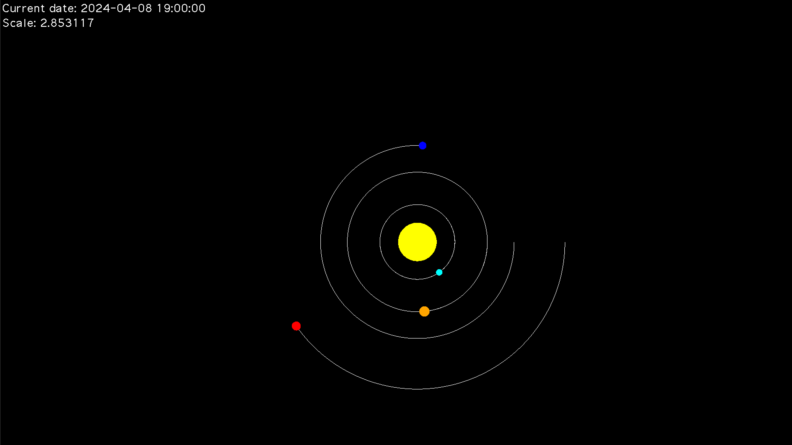

# Solar System Simulation

A C++ simulation of the solar system using SFML for graphical rendering. This project models the motion of celestial bodies using Newtonian physics and numerical integration methods.

## Features

- **Realistic Physics**: Implements gravitational interactions between celestial bodies using the Runge-Kutta 4th order method.
- **Graphical Visualization**: Uses SFML to render planets and their orbits in a 2D space.
- **User Interaction**: Allows zooming and panning of the view to explore the solar system.
- **Keyboard Controls**: Move around the simulation using arrow keys or W, A, S, D keys.
- **Scalable Design**: Easily add or modify celestial objects in the simulation.

## Simulation Accuracy
The simulation uses the Runge-Kutta 4th order method for solving differential equations, which is known for its high accuracy in numerical computations. However, due to the following factors, the simulation still experiences a small margin of error:

- Time Step: The accuracy of the orbits is influenced by the size of the time step used in the simulation. Larger time steps may result in less accurate orbital paths, especially over long periods. It is recommended to experiment with smaller time steps for more precise simulations.


- Gravitational Constants: The gravitational constant and object masses are adjusted for scaling purposes, which can introduce minor deviations from real-world values.


- Numerical Precision: The floating-point arithmetic used in the simulation may lead to minimal inaccuracies in position and velocity calculations, especially in long-running simulations.


In general, the error margin is kept within acceptable limits for typical simulation durations (up to several simulated years). For more detailed studies or long-term accuracy, further refinements in time step control and precision tuning may be required.

## Demo





## Requirements

- C++17 or higher
- SFML 2.5 or later

## Installation

1. Clone the repository:
   ```bash
   git clone https://github.com/arients/SolarSystem.git
   cd SolarSystem
   
2. Install SFML:
- Windows: Download the SFML SDK from SFML Downloads and follow the installation instructions.

- macOS: Install via Homebrew:
    ```bash
    brew install sfml
- Linux: Install via your package manager (e.g., for Ubuntu):
    ```bash
    sudo apt-get install libsfml-dev

### Controls:
- Zoom In: Press + or = 
- Zoom Out: Press - or _
- Move Up: Press W or Up Arrow ↑ 
- Move Down: Press S or Down Arrow ↓
- Move Left: Press A or Left Arrow ←
- Move Right: Press D or Right Arrow →

### Project Structure
- src/: Source code files. 
- include/: Header files. 
- assets/: Assets like fonts or images. 
- CMakeLists.txt: Build configuration. 
- README.md: Project documentation.
